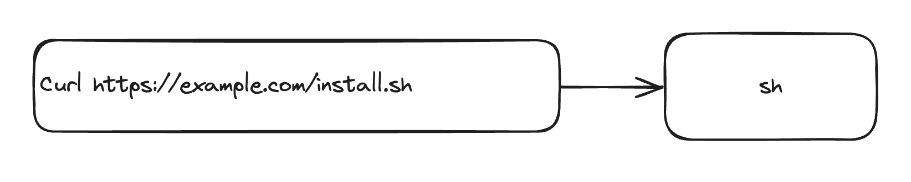
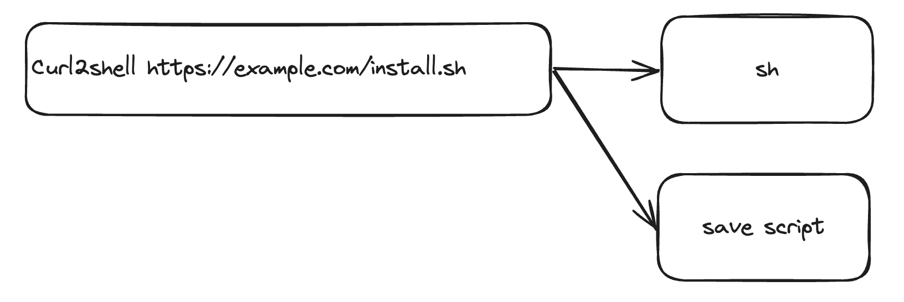

# curl2shell cli

Installing software with `curl <url> | sh` is convenient but requires running code without looking at it.

curl2shell tracks scripts that are installed with `curl <url> | sh` , by saving the script before passing it to `sh`.

The curl2shell CLI is drop in replacement for `curl` that wraps `curl`. curl2shell executes the underlying curl command and uploads the results before passing the output to `stdout` to be piped to `sh`. The scripts are uploaded to [curl2shell.com](curl2shell.com), take a look at some!

### Install

`curl -fsSL https://raw.githubusercontent.com/curl2shell/cli/main/install.sh | sh`

OR

`curl2shell -fsSL https://raw.githubusercontent.com/curl2shell/cli/main/install.sh | sh`

### Example usage

```diff
-curl -fsSL https://curl2shell.com/install.sh
+curl2shell -fsSL https://curl2shell.com/install.sh
```

#### Before



#### After


